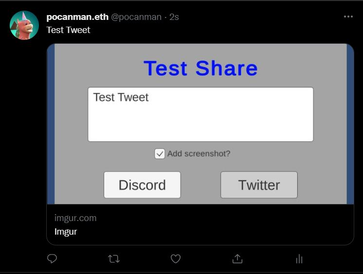

# Unity WebGL Sharing through Discord and Twitter

[Live demo](https://alto-io.github.io/unity-webgl-share-lego/Builds/WebGL/index.html)

To get this live demo to work, you will need an Imgur Client ID and a Discord Webhook. See the next section how to get these values. When you have them, copy to clipboard and click the Paste button on screen. Simply hitting CTRL+V on your keyboard will not work. This is a known issue for Unity WebGL builds.

## Getting started

1. Copy `Assets/Scripts/ShareUtil.cs` to your project
1. Create a new game object and attach the `ShareUtil` component
1. Fill in the ImgurClientId and DiscordWebhook parameters. These are important
	1. Get an Imgur Client Id by following the instructions from [here](https://apidocs.imgur.com/)
	1. Get a Discord Webhook URL by following the "Making A Webhook" section of this [guide](https://support.discord.com/hc/en-us/articles/228383668-Intro-to-Webhooks)
1. Add a discord avatar image, it should be a publicly accessible image that will be used as an avatar by the webhook when posting in Discord
1. Call `PostToDiscord` and/or `PostToTwitter`

## ShareUtil.cs

The main code responsible for posting is the `ShareUtil` class to be found in `Assets/Scripts/ShareUtil.cs`

The different functions have a coroutine version where the web requests will be handled. You can opt to call the coroutine or the function. Each function is documented in code to further ddefine what the function does and what each parameter is for.

## Why is Imgur needed?

This code uses [Twitter Web Intents](https://developer.twitter.com/en/docs/twitter-for-websites/web-intents/overview) for tweeting. This is a very convenient method as we don't need the user to authenticate their account to our app. The user also has the option to view and edit the tweet before actual posting.

The problem with this approach is that we can't attach a screenshot to the tweet. To do so, we have to use Imgur (a image sharing service) and append the imgur url of the image so it will appear with the tweet.

